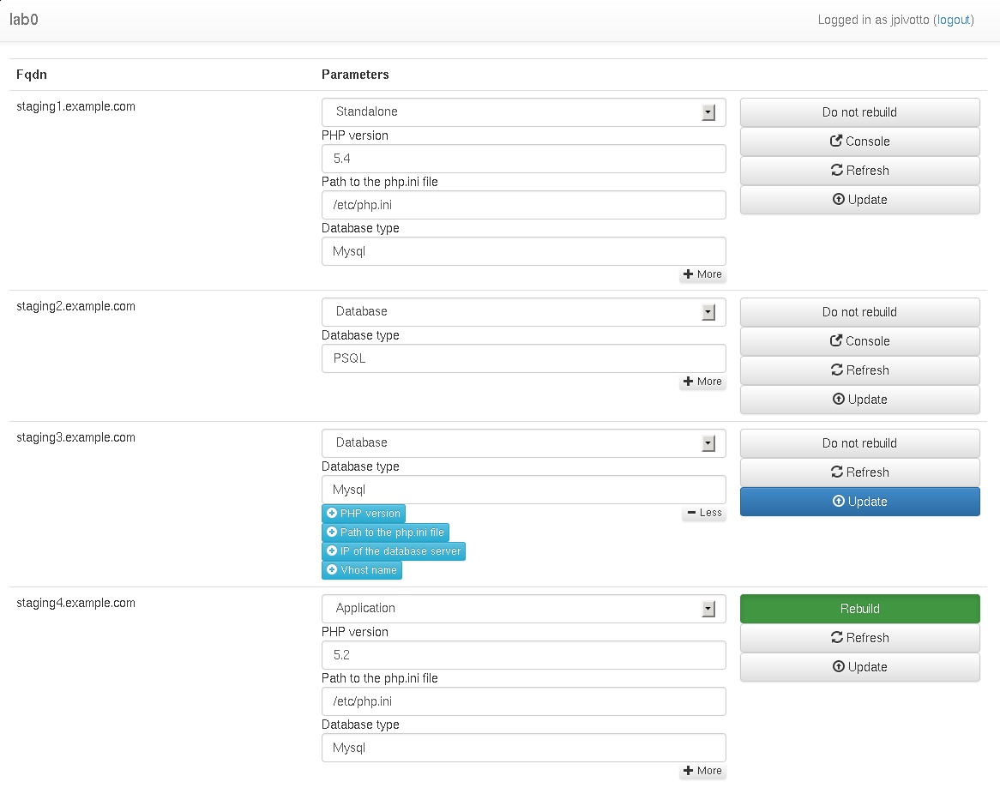

# lab0

A simple frontend to Foreman and its Puppet integration.

This software allows foreman users to simply change per-host parameters in
puppet classes, if they are managed via foreman.

## Technologies

### Backend

* Django
* Django-tastypie
* Python-requests

### Frontend


* AngularJS
* Bootstrap


## Settings

Create a file under lab0, called `secure_settings.py`.

Setup LDAP authentication in django and foreman and assign host to users in
Foreman.

```python
SECRET_KEY = 'RB[/\`;[x2KE?15AE&_xYc_Bynz#ysSoe*p"s8&8+J1"e"QPzBqf'
DEBUG = False

FOREMAN_URL = 'https://foreman.example.com/'

#that user needs to be admin
FOREMAN_USERNAME = 'django-foreman'
FOREMAN_PASSWORD = 'ooTaing1'

#smart class parameters that will be overriden
FOREMAN_SMART_CLASS_PARAMETERS={
        'php_version': {
            'id': 459,
            'label': 'PHP version'
        },
        'php_ini': {
            'id': 461,
            'label': 'Path to the php.ini file'
        },
        'database_server': {
            'id': 564,
            'label': 'IP of the database server'
        },
    }

#used to display console links
FOREMAN_COMPUTE_RESOURCES_WITH_CONSOLE=[1,3,5]

#hostgroups we can manage
FOREMAN_HOSTGROUPS=[
        {'id':'2', 'label': 'Basebox'},
        {'id':'10', 'label': 'Standalone'},
        {'id':'11', 'label': 'Database'},
        {'id':'12', 'label': 'Application'}
        ]
```

Screenshot
==========




License
=======

Copyright 2014 Julien Pivotto <roidelapluie@inuits.eu>

Licensed under the Apache License, Version 2.0 (the "License");
you may not use this file except in compliance with the License.
You may obtain a copy of the License at

http://www.apache.org/licenses/LICENSE-2.0

Unless required by applicable law or agreed to in writing, software
distributed under the License is distributed on an "AS IS" BASIS,
WITHOUT WARRANTIES OR CONDITIONS OF ANY KIND, either express or implied.
See the License for the specific language governing permissions and
limitations under the License.
